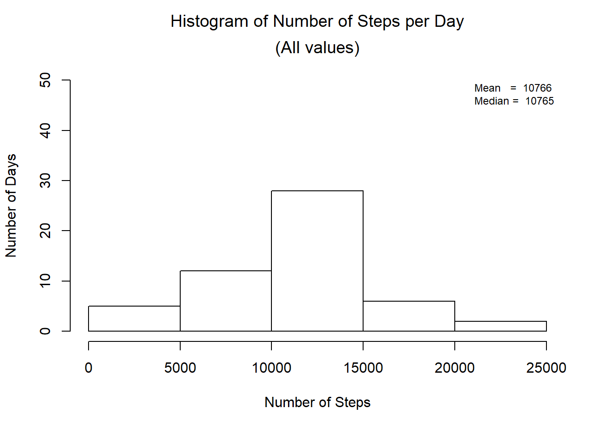
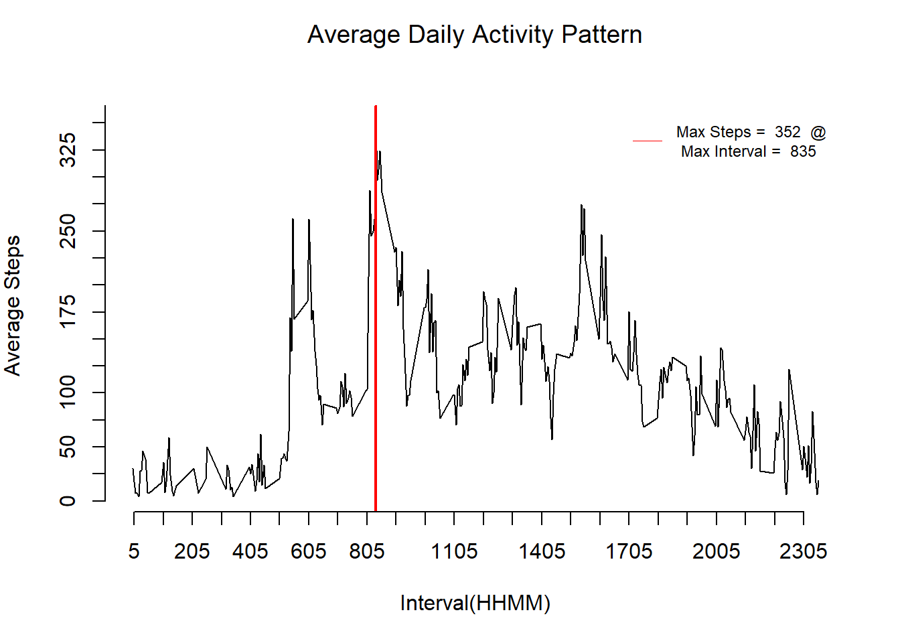
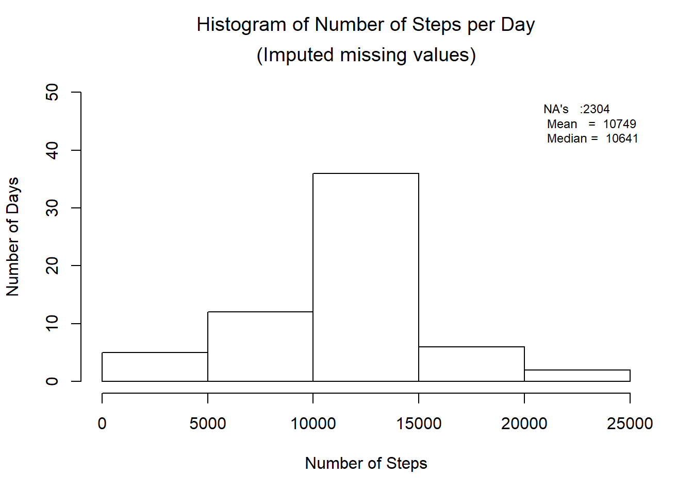
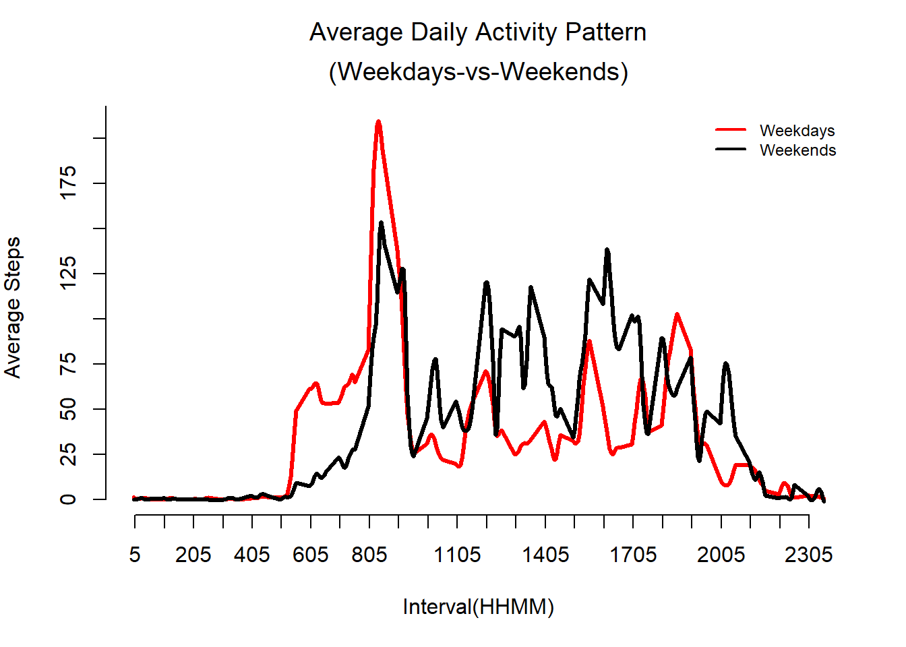

# Data Science Specialization: Reproducible Research Course Project 1
Tony Shaw  
July 28, 2017  


## Introduction

It is now possible to collect a large amount of data about personal movement using activity monitoring devices such as a Fitbit, Nike Fuelband, or Jawbone Up. These type of devices are part of the "quantified self" movement - a group of enthusiasts who take measurements about themselves regularly to improve their health, to find patterns in their behavior, or because they are tech geeks. But these data remain under-utilized both because the raw data are hard to obtain and there is a lack of statistical methods and software for processing and interpreting the data.

This assignment makes use of data from a personal activity monitoring device. This device collects data at 5 minute intervals through out the day. The data consists of two months of data from an anonymous individual collected during the months of October and November, 2012 and include the number of steps taken in 5 minute intervals each day.
The data for this assignment can be downloaded from the course web site:

Dataset: <a href="https://github.com/fordtronic/RepData_PeerAssessment1/blob/master/activity.zip", target="_blank">Activity monitoring data [52K]</a><br>

The variables included in this dataset are:

-steps: Number of steps taking in a 5-minute interval (missing values are coded as NA)<br>
-date: The date on which the measurement was taken in YYYY-MM-DD format<br>
-interval: Identifier for the 5-minute interval in which measurement was taken<br>

The dataset is stored in a comma-separated-value (CSV) file and there are a total of 17,568 observations in this dataset.

## The Assignment

This assignment is submitted in a single multi-part report. The report is designed to answer the questions from the Coursera peer-graded assignment course project about personal movement activity. The entire assignment and answers to the question are contained in a single R markdown document that was processed by knitr and transformed into an HTML file, which you are currently viewing.

The report includes the code that was used to generate the plots in this report. The code is included so thatWhen peer evaluators will be able to review the code for the analysis.

The GitHub repository created for this assignment was forked from <a href="https://github.com/rdpeng/RepData_PeerAssessment1"> the course instructors repository</a>. The assignment was submitted by pushing completed files into <a href="https://github.com/fordtronic/RepData_PeerAssessment1">my forked repository on GitHub</a>. The assignment submission also consists of the SHA-1 commit ID for my Github repository state. This commit contains the full submission as described herein.


<ol type="1">
  <li>Code for reading in the dataset and/or processing the data</li>

```r
zipUrl <- "http://d396qusza40orc.cloudfront.net/repdata%2Fdata%2Factivity.zip"
download.file(zipUrl, destfile= "activity.zip")
unzip("activity.zip")
activity <- read.table("activity/activity.csv",header = TRUE, sep = ",")
byDay <- subset(activity, activity$steps != 0) %>% group_by(date) %>% summarise(n = sum(steps))
byDayCln <- na.omit(byDay)
byDayAvg <- summarise(byDayCln, x=mean(n), y=median(n))
```
<li>Histogram of the total number of steps taken each day</li>
<li>Mean and median number of steps taken each day</li>

```r
#par(mfrow = c(2,2), mar = c(5,3,5,3))
hist(byDayCln$n, ylab = "Number of Days", xlab = "Number of Steps", ylim = c(0,50), 
     main = expression(atop("Histogram of Number of Steps per Day","(All values)")))
     legend("topright",legend = paste(" Mean   = ", as.integer(byDayAvg$x),"\n",
     "Median = ", as.integer(byDayAvg$y)),cex = 0.75,pt.cex = 0.3, inset = .01,bty = "n")
```

<!-- -->
<li>Time series plot of the average number of steps taken</li>
<li>The 5-minute interval that, on average, contains the maximum number of steps</li>

```r
byInt <- subset(activity, activity$steps != 0) %>% group_by(interval) %>% summarise(n = mean(steps))
a <- str_pad(byInt$interval,width = 4, side = "left", pad = "0") # %>% str_pad(width = 6, side = "right", pad = "0") 
b <- paste0(substr(a,1,2),":",substr(a,3,4),":", substr(a,5,6))
plot(byInt$interval, byInt$n, type = "l", ylab = expression("Average Steps"), col = "black", xlab = "Interval(HHMM)",
     main = expression(atop("Average Daily Activity Pattern")),axes = FALSE)
     abline(v=with(byInt, interval[n == max(byInt$n)]), col = "red", lwd = 2)
     axis(1, at=seq(5,2355, by=100))
     axis(2, at=seq(0,400, by=25))
     legend("topright",lty = 1, lwd=0,legend = paste("Max Steps = ", as.integer(max(byInt$n))," @","\n", 
     "Max Interval = ", with(byInt, interval[n == max(byInt$n)])),col=c("red"),cex = 0.75,pt.cex = 0.3, inset = .01,bty = "n")
```

<!-- -->
<li>Code to describe and show a strategy for imputing missing data</li>

```r
#1.Find number of missing values
missing <- grep("NA's   :",summary(activity), value = TRUE)
#2.Fill missing values with the mean of the interval
byInt2 <- subset(activity, activity$steps != "NA") %>% group_by(interval) %>% summarise(n = mean(steps))
activity$avgstep <- byInt2$n
count <- 0
i <- 1
for(i in 1:length(activity$steps)){
if(is.na(activity$steps[i]==TRUE)){
    activity$steps[i] <- activity$avgstep[i]
    count <- count+1
    }
i <- i+1}
#3.Create a new dataset that is equal to the original dataset but with the missing data filled in.
activityCln <- data.frame(1:length(activity$steps))
activityCln$steps <- as.integer(activity$steps)
activityCln$date <- activity$date
activityCln$interval <- activity$interval
activityCln <- activityCln[,-1]
```
<li>Histogram of the total number of steps taken each day after missing values are imputed</li>

```r
#4.Histogram of imputed value dataset
byDay2 <- subset(activityCln, activityCln$steps != 0) %>% group_by(date) %>% summarise(n = sum(steps))
byDayAvg2 <- summarise(byDay2, x=mean(n), y=median(n))
hist(byDay2$n, ylab = "Number of Days", xlab = "Number of Steps", ylim = c(0,50), 
     main = expression(atop("Histogram of Number of Steps per Day","(Imputed missing values)")))
legend("topright",legend = paste(missing,"\n","Mean   = ", as.integer(byDayAvg2$x),"\n",
                            "Median = ", as.integer(byDayAvg2$y)),col=c("red"), cex = 0.75,pt.cex = 0.3, inset = .01,bty = "n")
```

<!-- -->
<li>Panel plot comparing the average number of steps taken per 5-minute interval across weekdays and weekends</li>

```r
activityCln$day <- ifelse(weekdays.Date(as.Date(activityCln$date))=="Saturday"|weekdays.Date(as.Date(activityCln$date))=="Sunday"
                        ,"Weekend","Weekday")

byDay <- activityCln %>% group_by(day,interval) %>% summarise(x = mean(steps))
l1 <- subset(byDay, byDay$day == "Weekday")
l2 <- subset(byDay, byDay$day == "Weekend")
plot(smooth.spline(l1$interval, l1$x),type = "l", lty=1,ylab = expression("Average Steps"), col = "red",lwd=3, xlab = "Interval(HHMM)",
     main = expression(atop("Average Daily Activity Pattern","(Weekdays-vs-Weekends)")),axes = FALSE)
    axis(1, at=seq(5,2355, by=100))
    axis(2, at=seq(0,400, by=25))
    legend("topright",lty = 1, lwd=2,legend = c("Weekdays", "Weekends"),col=c("red","black"),cex = 0.75,pt.cex = 0.3, inset = .01,bty = "n")
    lines(smooth.spline(l2$interval,l2$x), type = "l",lty=1,lwd=3,col="black")
```

<!-- -->
</ol>
